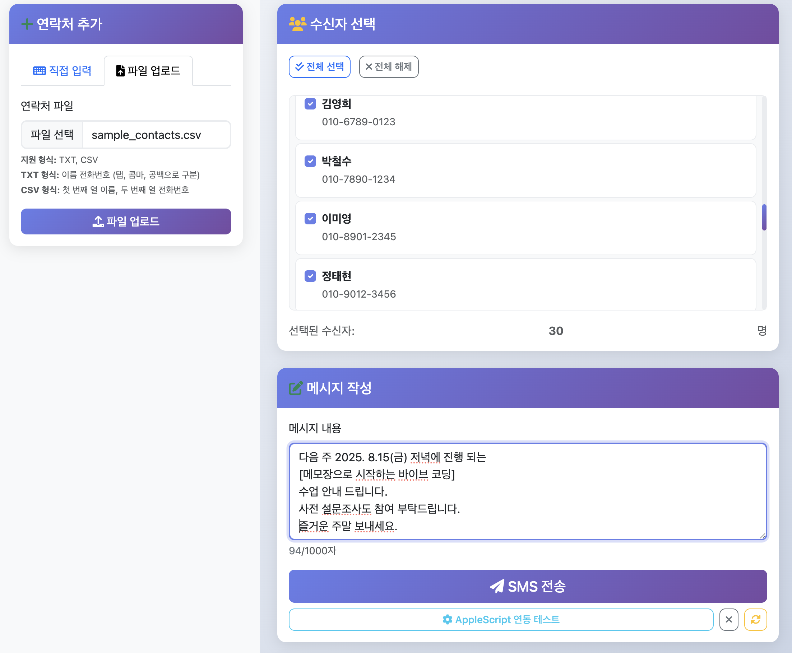
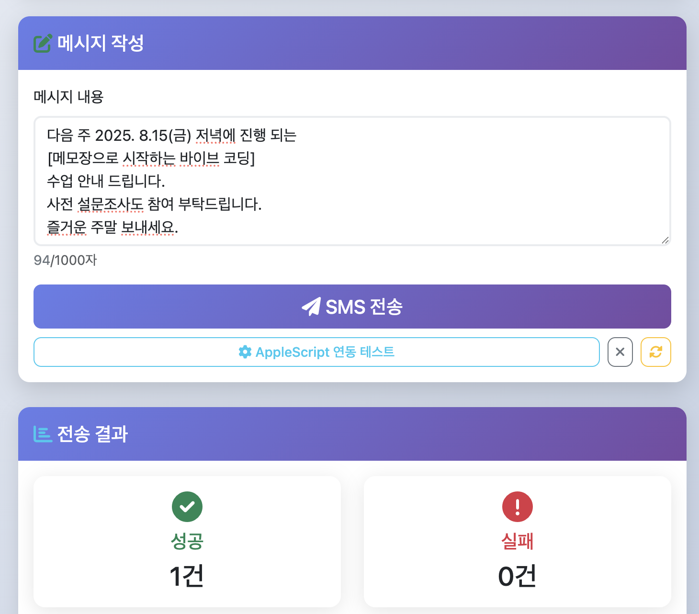

# 🍎 MacOS Send Message

[](https://www.python.org/downloads/)
[](https://flask.palletsprojects.com/)
[](https://www.apple.com/macos/)
[](LICENSE)
[](https://github.com/jvisualschool/macos_send_message)

맥북에서 실행되는 웹 기반 SMS 발송 애플리케이션입니다. AppleScript를 통해 macOS Messages 앱과 연동하여 여러 명에게 동시에 문자 메시지를 보낼 수 있습니다.

## � 목스크린샷

### 메인 인터페이스

*연락처 추가 및 수신자 선택 화면*

### SMS 전송 결과

*실시간 전송 결과 및 성공/실패 현황*

## 📋 목차

- [주요 기능](#-주요-기능)
- [시스템 요구사항](#-시스템-요구사항)
- [빠른 시작](#-빠른-시작)
- [사용자 가이드](#-사용자-가이드)
- [개발자 가이드](#-개발자-가이드)
- [보안 고려사항](#-보안-고려사항)
- [문제 해결](#-문제-해결)
- [기여하기](#-기여하기)
- [라이선스](#-라이선스)

## ✨ 주요 기능

### 📱 연락처 관리
- **직접 입력**: 이름과 전화번호 수동 입력
- **파일 업로드**: CSV 파일에서 대량 연락처 가져오기
- **중복 방지**: 전화번호 정규화를 통한 중복 연락처 자동 방지
- **실시간 검증**: 전화번호 형식 자동 검증 및 정규화

### 📨 SMS 발송
- **일괄 전송**: 최대 수백 명에게 동시 메시지 전송
- **실시간 결과**: 성공/실패 현황 즉시 확인
- **AppleScript 연동**: macOS Messages 앱과 네이티브 연동
- **전송 로그**: 상세한 전송 결과 및 오류 메시지 제공

### 🎨 사용자 인터페이스
- **반응형 디자인**: 데스크톱/모바일 최적화
- **모던한 UI**: Bootstrap 5 기반 그라데이션 디자인
- **실시간 피드백**: 글자 수 카운터, 로딩 상태, 진행률 표시
- **직관적 UX**: 드래그 앤 드롭, 키보드 단축키 지원

## 🖥️ 시스템 요구사항

### 필수 요구사항
- **운영체제**: macOS 10.14 (Mojave) 이상
- **Python**: 3.7 이상
- **Messages 앱**: macOS 기본 설치
- **iPhone 연동**: SMS 전송을 위한 iPhone 필요

### 권장 사양
- **메모리**: 4GB RAM 이상
- **저장공간**: 100MB 이상 여유 공간
- **네트워크**: 안정적인 인터넷 연결

## 🚀 빠른 시작

### 1. 저장소 클론
```bash
git clone https://github.com/jvisualschool/macos_send_message.git
cd macos_send_message
```

### 2. 자동 설치 및 실행 (권장)
```bash
chmod +x run.sh
./run.sh
```

### 3. 수동 설치
```bash
# 가상환경 생성
python3 -m venv venv
source venv/bin/activate

# 의존성 설치
pip install -r requirements.txt

# Messages 앱 실행
open -a Messages

# 웹앱 실행
python3 app.py
```

### 4. 웹 브라우저 접속
```
http://localhost:5001
```

## 👥 사용자 가이드

### 연락처 추가하기

#### 방법 1: 직접 입력
1. 좌측 **"연락처 추가"** → **"직접 입력"** 탭 선택
2. **이름** 입력 (예: 홍길동)
3. **전화번호** 입력 (예: 010-1234-5678)
4. **"추가"** 버튼 클릭

#### 방법 2: 파일 업로드
1. **"파일 업로드"** 탭 선택
2. CSV 파일 선택 (sample_contacts.csv 참조)
3. **"파일 업로드"** 버튼 클릭
4. 미리보기에서 연락처 확인
5. **"연락처 가져오기"** 버튼으로 최종 추가

**지원 파일 형식:**

**CSV 파일 예시:**
```csv
이름,전화번호
홍길동,010-1234-5678
김철수,010-9876-5432
이영희,010-5555-6666
```

### SMS 발송하기

1. **수신자 선택**: 우측 수신자 목록에서 발송 대상 선택
2. **메시지 작성**: 내용 입력 (최대 1000자)
3. **전송 실행**: "SMS 전송" 버튼 클릭
4. **결과 확인**: 성공/실패 현황 확인

### 전화번호 형식

**지원하는 형식:**
- `010-1234-5678` (권장)
- `01012345678`
- `010 1234 5678`
- `+82-10-1234-5678` (국제번호)

**자동 변환:**
- 입력 시 자동으로 `010-1234-5678` 형식으로 정규화
- 중복 번호 자동 감지 및 방지

## 🛠️ 개발자 가이드

### 프로젝트 구조
```
macos_send_message/
├── app.py                 # Flask 메인 애플리케이션
├── requirements.txt       # Python 의존성
├── run.sh                # 실행 스크립트
├── contacts.json         # 연락처 데이터 (자동 생성)
├── .env.example          # 환경 변수 설정 예시
├── .gitignore            # Git 제외 파일 목록
├── README.md             # 프로젝트 소개 (GitHub 메인)
├── README_DEPLOY.md      # 상세 배포 가이드
├── SECURITY_AUDIT.md     # 보안 감사 리포트
├── screenshot1.png       # 앱 스크린샷 1
├── screenshot2.png       # 앱 스크린샷 2
├── templates/
│   └── index.html        # 메인 웹 페이지
├── static/
│   ├── css/
│   │   └── style.css     # 커스텀 스타일
│   └── js/
│       └── app.js        # 클라이언트 JavaScript
├── sample_contacts.csv   # 샘플 CSV 파일 (30개 연락처)
└── logs/                 # 로그 파일 (런타임 생성)
    └── sms_app.log       # 애플리케이션 로그
```

### 기술 스택

**백엔드:**
- **Flask 2.3.3**: 웹 프레임워크
- **Flask-CORS 4.0.0**: CORS 지원
- **Python 3.7+**: 런타임 환경

**프론트엔드:**
- **Bootstrap 5**: UI 프레임워크
- **Font Awesome 6**: 아이콘
- **Vanilla JavaScript**: 클라이언트 로직

**시스템 연동:**
- **AppleScript**: macOS Messages 앱 연동
- **subprocess**: 시스템 명령 실행

### API 엔드포인트

#### 연락처 관리
```http
GET /api/contacts
POST /api/contacts
DELETE /api/contacts/{id}
```

#### 파일 업로드
```http
POST /api/upload-contacts
POST /api/import-contacts
```

#### SMS 전송
```http
POST /api/send-sms
GET /api/test-applescript
```

### 개발 환경 설정

#### 1. 개발 의존성 설치
```bash
pip install -r requirements.txt
pip install pytest pytest-cov black flake8  # 개발 도구
```

#### 2. 코드 품질 도구
```bash
# 코드 포맷팅
black app.py

# 린팅
flake8 app.py

# 테스트 실행
pytest tests/
```

#### 3. 디버그 모드 실행
```python
# app.py 마지막 줄 수정
app.run(debug=True, host='0.0.0.0', port=5001)
```

### 커스터마이징

#### 포트 변경
```python
# app.py 마지막 줄
app.run(debug=True, host='0.0.0.0', port=8080)  # 원하는 포트로 변경
```

#### UI 테마 변경
```css
/* static/css/style.css */
:root {
    --primary-color: #your-color;
    --secondary-color: #your-color;
}
```

#### 메시지 길이 제한 변경
```javascript
// static/js/app.js
const MAX_MESSAGE_LENGTH = 2000;  // 원하는 길이로 변경
```

## 🔒 보안 고려사항

### 데이터 보안
- ✅ **로컬 저장**: 모든 연락처 데이터는 로컬 `contacts.json`에만 저장
- ✅ **외부 전송 없음**: 연락처 정보가 외부 서버로 전송되지 않음
- ✅ **세션 관리**: 브라우저 종료 시 임시 데이터 자동 정리
- ✅ **입력 검증**: XSS 방지를 위한 HTML 이스케이프 처리

### 시스템 보안
- ✅ **권한 최소화**: 필요한 최소 권한만 요청
- ✅ **AppleScript 샌드박싱**: Messages 앱에만 접근 제한
- ✅ **파일 업로드 제한**: TXT/CSV 파일만 허용, 크기 제한
- ✅ **CORS 설정**: 적절한 CORS 정책 적용

### 개인정보 보호
- ✅ **로그 최소화**: 민감한 정보 로깅 방지
- ✅ **임시 파일 정리**: 업로드된 파일 자동 정리
- ✅ **메모리 관리**: 메시지 내용 메모리에서 즉시 정리

### 권장 보안 설정

#### 1. 방화벽 설정
```bash
# 로컬 접근만 허용 (기본값)
# 외부 접근이 필요한 경우에만 0.0.0.0 사용
```

#### 2. 파일 권한 설정
```bash
chmod 600 contacts.json  # 소유자만 읽기/쓰기
chmod 755 run.sh         # 실행 권한
```

#### 3. 정기적인 데이터 정리
```bash
# 주기적으로 로그 파일 정리
find . -name "*.log" -mtime +7 -delete
```

## 🚨 문제 해결

### 자주 발생하는 문제

#### 1. "Messages 앱에 연결할 수 없습니다"
**원인**: AppleScript 권한 부족
**해결방법**:
1. **시스템 환경설정** → **보안 및 개인정보보호** → **개인정보보호**
2. **자동화** 선택 → **터미널** → **Messages** 체크
3. **접근성** 선택 → **터미널** 추가 및 활성화

#### 2. "ModuleNotFoundError: No module named 'flask'"
**원인**: 가상환경 미활성화 또는 의존성 미설치
**해결방법**:
```bash
source venv/bin/activate
pip install -r requirements.txt
```

#### 3. "포트 5001이 이미 사용 중"
**원인**: 다른 프로세스가 포트 사용 중
**해결방법**:
```bash
# 포트 사용 프로세스 확인
lsof -i :5001

# 프로세스 종료 또는 다른 포트 사용
# app.py에서 포트 번호 변경
```

#### 4. 파일 업로드 실패
**원인**: 파일 형식 또는 인코딩 문제
**해결방법**:
- UTF-8 또는 CP949 인코딩으로 저장
- TXT/CSV 형식 확인
- 파일 크기 10MB 이하 확인

### 디버깅 방법

#### 1. 로그 확인
```bash
# 터미널에서 실행 시 로그 확인
python3 app.py

# 브라우저 개발자 도구 (F12) 콘솔 확인
```

#### 2. AppleScript 직접 테스트
```bash
osascript -e 'tell application "Messages" to activate'
```

#### 3. 권한 상태 확인
```bash
# 시스템 정보에서 권한 상태 확인
system_profiler SPApplicationsDataType | grep -A 5 Messages
```

## 🤝 기여하기

### 버그 리포트
1. [Issues](https://github.com/jvisualschool/macos_send_message/issues)에서 기존 이슈 확인
2. 새 이슈 생성 시 다음 정보 포함:
   - macOS 버전
   - Python 버전
   - 오류 메시지
   - 재현 단계

### 기능 제안
1. [Discussions](https://github.com/jvisualschool/macos_send_message/discussions)에서 아이디어 공유
2. 구체적인 사용 사례와 예상 효과 설명

### 코드 기여
1. Fork 후 feature 브랜치 생성
2. 코드 작성 및 테스트
3. Pull Request 생성

### 개발 가이드라인
- **코드 스타일**: Black 포맷터 사용
- **커밋 메시지**: Conventional Commits 규칙 준수
- **테스트**: 새 기능에 대한 테스트 코드 작성
- **문서화**: README 및 코드 주석 업데이트

## 📄 라이선스

이 프로젝트는 MIT 라이선스 하에 배포됩니다. 자세한 내용은 [LICENSE](LICENSE) 파일을 참조하세요.

## 🙏 감사의 말

- **Apple**: macOS Messages 앱 및 AppleScript 지원
- **Flask 팀**: 훌륭한 웹 프레임워크 제공
- **Bootstrap 팀**: 아름다운 UI 컴포넌트 제공
- **오픈소스 커뮤니티**: 지속적인 지원과 피드백

---

## 📞 지원 및 문의

- **GitHub Issues**: [버그 리포트 및 기능 요청](https://github.com/jvisualschool/macos_send_message/issues)
- **GitHub Discussions**: [일반적인 질문 및 토론](https://github.com/jvisualschool/macos_send_message/discussions)
- **GitHub Repository**: [https://github.com/jvisualschool/macos_send_message](https://github.com/jvisualschool/macos_send_message)

**⚡ 즐거운 SMS 발송 되세요! 🚀**

---

*마지막 업데이트: 2024년 8월*